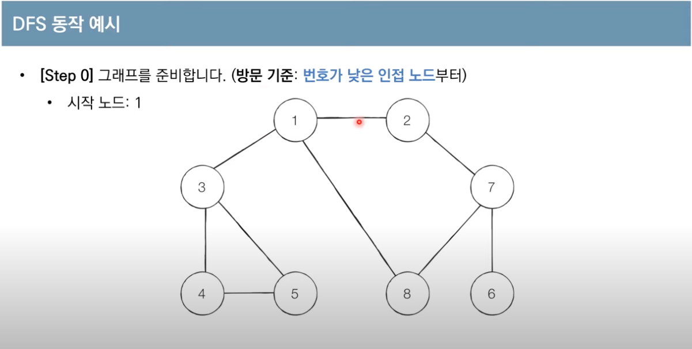
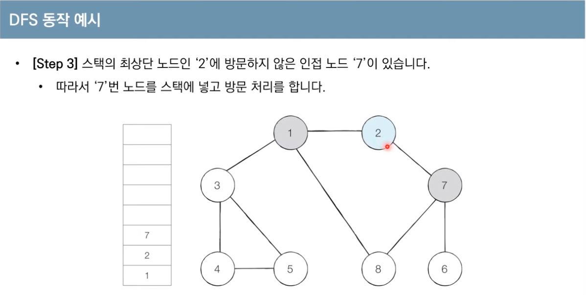
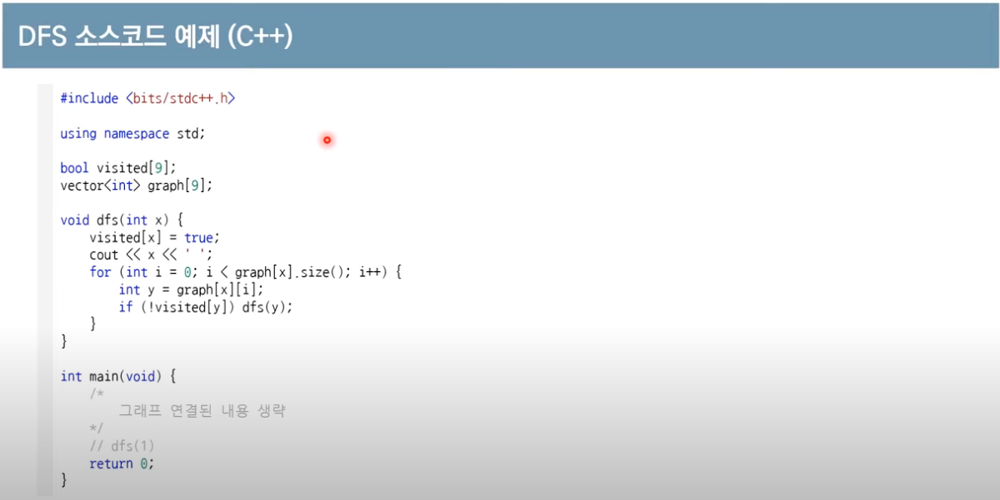

# DFS/BFS
- 탐색이란 많은 양의 데이터 중에서 원하는 데이터를 찾는 과정을 말합니다.   
- 대표적인 그래프 탐색 알고리즘으로는 DFS와 BFS가 있습니다.  

## 스택 자료구조 
입구와 출구가 동일한 형태로, 스택을 시각화 할 수 있다.   
선입후출, 먼저 들어 온 데이터가 나중에 나가는 형식의 자료구조   

파이썬에서는 append 와 pop 으로 그대로 구현 가능하다.   
c++ 에서는 stack<int> s 초기화 하고 s.push와 s.pop을 사용하면 된다.   

## 큐 자료구조 
먼저 들어 온 데이터가 먼저 나가는 형식(선입선출)의 자료구조 입니다.    
큐는 입구와 출구가 모두 뚫려 있는 터널과 같은 형태로 시각화 할 수 있다.     

파이썬에서는 from collections import deque 라이브러리를 사용하여 .append와 .popleft를 사용하여,    
큐 자료 구조를 구현 가능하다. pop(0)는 시간 복잡도가 O(n)이라 deque를 사용해야 한다.   

c++에서는 queue<int> q 로 초기화 하고, q.push, q.pop()를 사용해서 구현이 가능하다.    

## 재귀 함수(Recursive Function)란
자기 자신을 다시 호출하는 함수를 의미한다. 재귀 함수를 문제 풀이에서 사용할 때는 재귀 함수의 종료조건을 반드시 명시해야 합니다.    
종료 조건을 제대로 명시하지 않으면 함수가 무한히 호출될 수 있습니다.   

모든 재귀함수는 반복문을 이용하여 동일한 기능을 구현 할 수 있다.    
컴퓨터가 함수를 연속적으로 호출하면 컴퓨터 메모리 내부의 스택 프레임에 쌓입니다.   
그래서 스택을 사용해야 할 때 구현상 스택라이브러리 대신에 재귀 함수를 이용하는 경우가 많습니다.   
```python 
gcd.py 
```


## DFS - Depth First search 
- DFS 는 깁이 우선 탐색이라고도 부르며 그래프에서 깊은 부분을 우선적으로 탐색하는 알고리즘 입니다. 
- 스택 자료구조(혹은 재귀 함수)를 이용하여, 구체적인 동작 과정은 다음과 같다. 

1. 탐색 시작 노드를 스택에 삽입하고 방문처리를 한다. 
2. 스택의 최상단 노드에 방문하지 않은 인접한 노드가 하나라도 있으면 그 노드를 스택에 넣고 방문 처리한다. 방문하지 않은 인접 노드가 없으면 스택에서 최상단 노드를 꺼냅니다. 
3. 더 이상 2번의 과정을 수행할 수 없을 때까지 반복합니다. 

 

- 방문 기준은 매번 달라질 수 있음 - 보통 번호가 낮은 인접 노드 


- 1,2,7,6 까지 들어감, 더 이상 이동 할 곳이 없어 6을 뺌 
- 전체 노드의 탐색 순서(스택에 들어간 순서) 
    - 1,2,7,6,8,3,4,5

```python
example_dfs.py  
```

